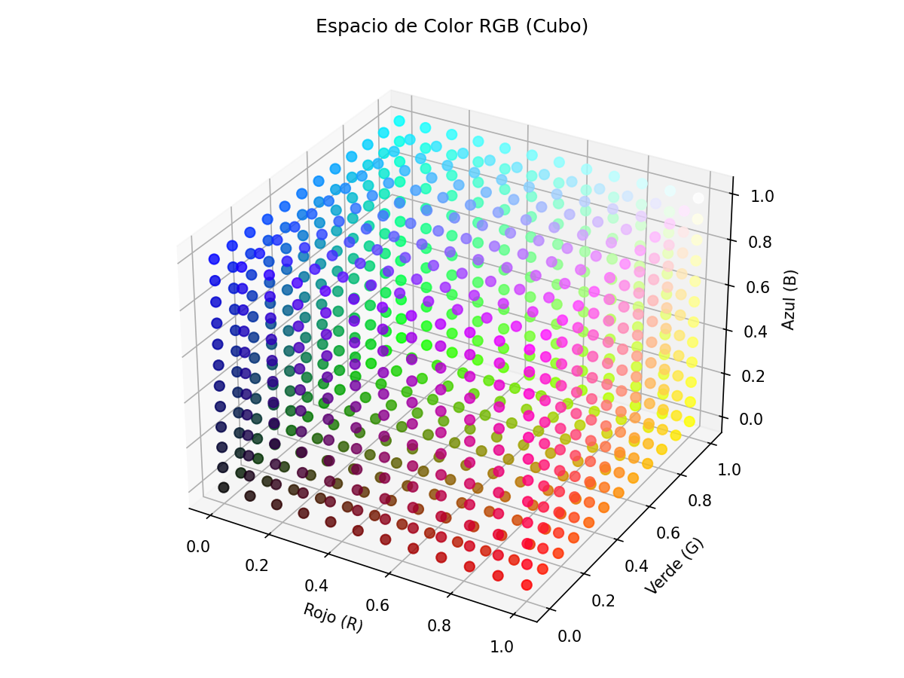
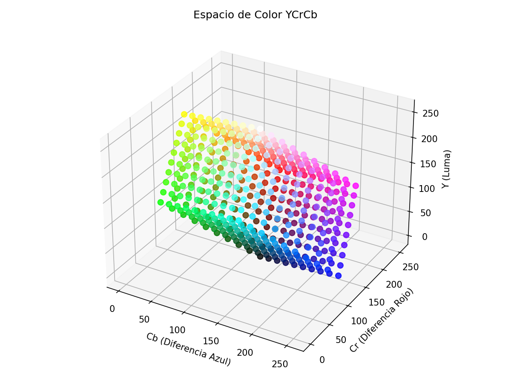
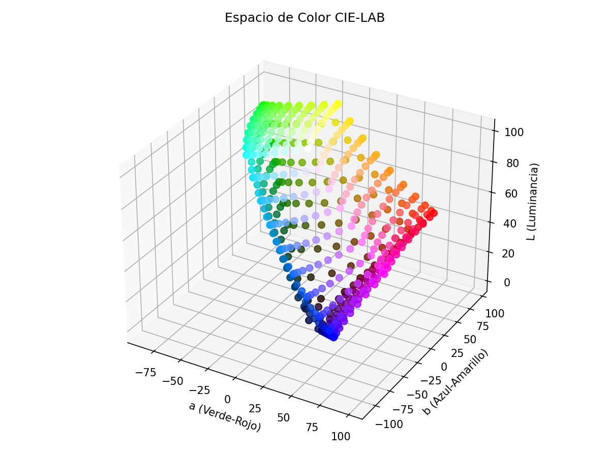
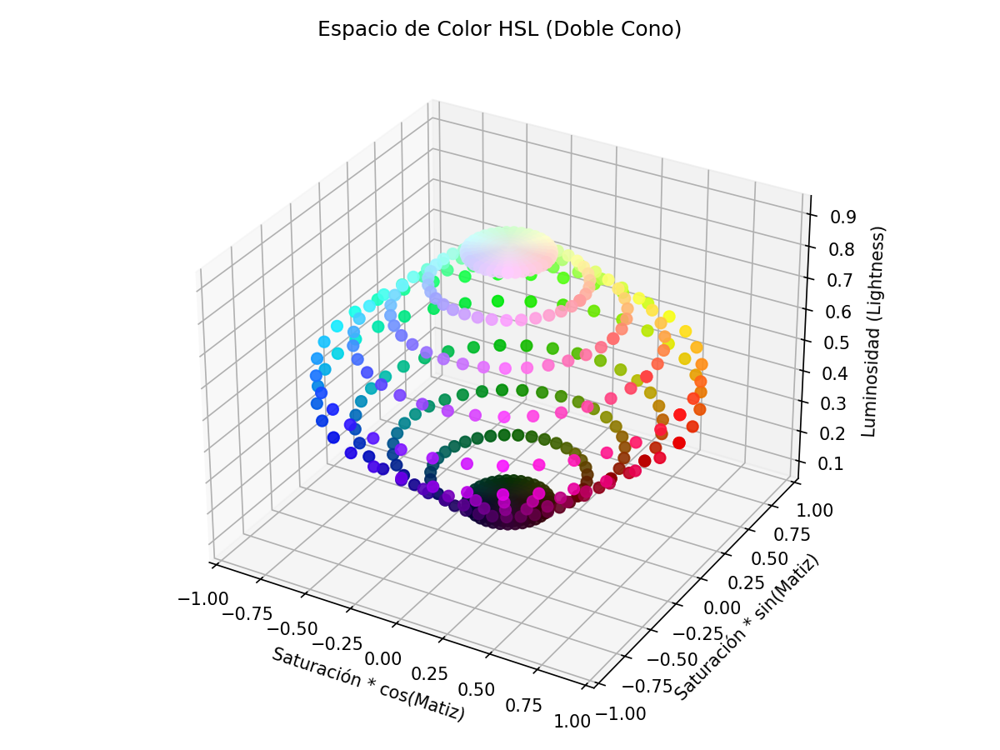
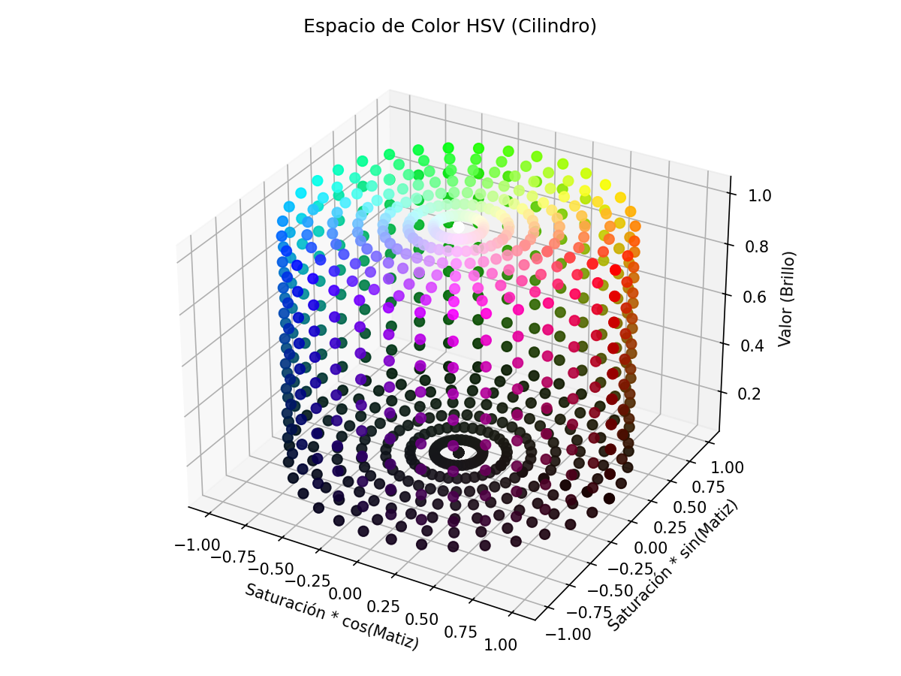

# Justificación: Representación HSV frente a otras alternativas para Detección de Color

Este documento respalda la decisión técnica de utilizar el espacio de color **HSV (Hue, Saturation, Value)** como la opción óptima para nuestro sistema de visión por computadora, justificando por qué es superior a otras representaciones (RGB, YCrCb, LAB, HSL) especialmente frente a nuestro principal desafío: **las variaciones de iluminación**.

---

## 1. El Desafío Principal: La Iluminación
En nuestro caso particular, la iluminación del entorno no es constante. Las sombras, los reflejos y los cambios bruscos en la luz ambiental afectan severamente la forma en que las cámaras perciben los objetos. 

Un sistema robusto y confiable debe ser capaz de separar la información del "color real" (crominancia) de la cantidad de luz que recibe (luminancia).

---

## 2. Análisis de Alternativas y sus Deficiencias

### A. Espacio RGB (Red, Green, Blue)
El espacio RGB está diseñado para la emisión de luz en pantallas o captura pura de sensores, no para entender analíticamente el color.
* **El Problema:** La luminancia (luz) y la crominancia (color) están **completamente mezcladas**. Si un objeto rojo se oscurece por una sombra, los tres canales (R, G y B) cambian rápida y desproporcionadamente.
* **Matrices comparativas (Simulación de píxeles):**

  *(Matriz de objeto Rojo puro bajo luz normal)*
  | R   | G  | B  |
  | --- | -- | -- |
  | 200 | 20 | 20 |

  *(Matriz del mismo Rojo puro bajo sombra)*
  | R   | G  | B  |
  | --- | -- | -- |
  | 90  | 5  | 5  |

* **Conclusión contra RGB:** Para detectar el mismo objeto bajo ambas luces, requeriríamos rangos muy amplios de R, G y B, lo que generaría inevitablemente **falsos positivos** (terminaríamos detectando superficies marrones, naranjas o púrpuras por accidente).

---

### B. Espacios YCrCb / CIE-LAB (Espacios Perceptuales)
Estos espacios se desarrollaron específicamente para resolver el problema del RGB: aíslan la luz del color. (En YCrCb, la 'Y' es Luma; en LAB, la 'L' es Luminancia). Al ignorar estos canales, la detección se vuelve insensible a las sombras.
* **El Problema:** Aunque matemáticamente son robustos ante la luz, **no son intuitivos para el filtrado de colores**. La información del color se divide en dos ejes superpuestos en un plano cartesiano (ej. Cr/Cb o A/B).
* **Conclusión contra YCrCb / LAB:** Filtrar "el color rojo" requiere definir fórmulas para enmarcar circunferencias o elipses en ese espacio 2D cartesiano. Esto hace que afinar los rangos de calibración en tiempo real sea sumamente complejo, poco lineal y costoso computacionalmente para microcontroladores o procesadores en el borde.

---

### C. Espacio HSL (Hue, Saturation, Lightness)
HSL es conceptualmente el "hermano gemelo" de HSV. Ambos son cilíndricos y representan el tono del color en grados (H).
* **El Problema:** La diferencia está en el manejo de la intensidad. En HSL (Lightness), cuando el nivel de luz llega al 100%, el color se vuelve blanco puro para todos los tonos matemáticamente (doble cono). En HSV (Value), se representa más como un cono simple, basándose en la intensidad de brillo, no en la luminosidad para volverse blanco.
* **Conclusión contra HSL:** En la visión artificial convencional soportada por librerías como OpenCV, las transformaciones geométricas y el descarte de píxeles oscuros o blancos es más predecible en HSV, ya que el control del cono de "Saturación vs Valor" reacciona mejor a operaciones morfológicas de limpieza de la imagen.

---

## 3. ¿Por qué HSV es la opción Definitiva e Insuperable?

El espacio **HSV (Hue, Saturation, Value)** es el estándar de oro en nuestro escenario porque proporciona la misma inmunidad a la luz que LAB o YCrCb, pero lo hace con una interfaz matemática sumamente simple orientada a rangos.

1. **Aislamiento Total Unidimensional (Hue):** El canal 'H' (Matiz) consolida toda la "identidad" del color en un solo valor numérico circular (del 0 al 179 en OpenCV). Por ejemplo, el rojo está siempre cerca del H=0.
2. **Matrices comparativas robustas a la variación de luz:**

  *(Matriz del mismo Rojo puro bajo luz normal en HSV)*
  | H   | S   | V   |
  | --- | --- | --- |
  | 0   | 230 | 200 |

  *(Matriz del mismo Rojo puro bajo sombra en HSV)*
  | H   | S   | V   |
  | --- | --- | --- |
  | 0   | 235 | 90  |

  > **Factor Clave:** Como demuestran las matrices, a diferencia de RGB, **los canales H (Tono) y S (Saturación) permanecen casi intactos**. El impacto brutal de la sombra fue absorbido el 100% por una sola columna: el Valor/Brillo (V).

3. **Inmunidad en la Calibración:** Ahora podemos detectar ese rojo consistentemente programando una regla muy básica que la computadora procesará rapidísimo: 
   *"Acepta cualquier píxel que tenga el Matiz (H) entre 350 y 10, y simplemente ignora cuán alto o bajo termine siendo el Brillo (V)."*

*(En la gráfica superior, el cilindro HSV. Nota cómo el canal 'H' o Matiz está distribuido en un perímetro circular y permite seleccionar el tono independientemente del 'V' Brillo, el cual es el eje vertical Z).*

---

### Resumen
Para resolver nuestros problemas constantes con las variaciones de iluminación de la escena, limitarse a RGB provocaría falsos positivos, mientras que migrar a LAB/YCrCb complicaría innecesariamente la lógica de calibración. **HSV nos brinda la separación perfecta entre crominancia y luminancia, condensando todo el tono de un color en un solo valor matemático**, lo cual lo convierte en la herramienta más rápida y precisa para resolver este problema.
